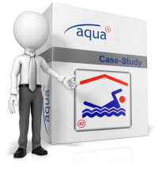

=  AquaGrails

:experimental:

arc42 case-study for a documentation toolchain using Enterprise-Architect (c),
Powerpoint (c), AsciiDoc within an automated (documentation) build toolchain...

It's build around _Children Swimming League_ - a fictional sporting league
invented by Peter Hruschka, and widely used within his requirements and architecture
classes.

The software solution is based upon Grails - and the documentation toolchain
is crafted and maintained by Ralf D. Müller.

The first draft of the documentation can be found here: 
include::src/docs/arc42-template.adoc[]
